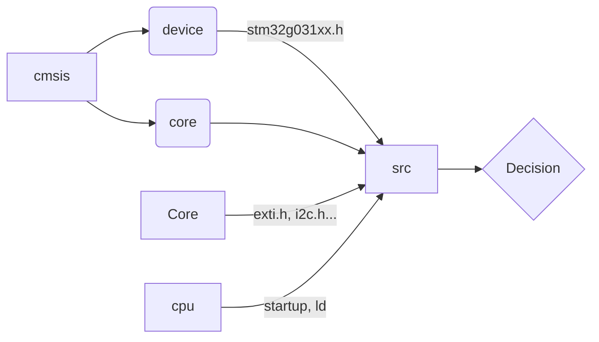

## Description of project

Project **DIY Soldering table**  is a firmware for the STM32G031F6P6 microcontroller used to control the temperature and the output information to the OLED display .
It is written in *CMSIS* and includes written libraries for configuring and controlling peripherals.

## Structure of project

- Workspace is organized as in the picture. The main loop of the program is executed in **main.c** in the */src/* directory
	> **Note:** But in future it will be RTOS management...

## Conceptions 
The project was based on the concept of **FSM (finite state machine)**, although it is redundant. The principle of its operation is that we have *event pool*, in which events from different subroutines are added and processed in an endless loop. Each event has its own transition state that handles the event. In the future, the state table will be involved and the code in C ++ will probably be rewritten. The principle is shown on the slide below and you can find out more about it by following [this link](https://robert-drummond.com/2015/04/21/event-driven-programming-finite-state-machines-and-nodejs/):

<kbd>
  
</kbd>

## Also
In addition, the **DMA** and **EXTI** principles are implemented in the project, which allow receiving input data without loading the main computing thread.

## Building

To build the program you need execute the make command in the terminal from the main working directory:
```bash
$ make
```
The result is 3 main formats of executable programs - **.hex**, **.bin** and **.elf**.

## Flashing
To flash the microcontroller, you need the *stlink* software. To install it use the command:
```bash
$ sudo apt-get -y install stlink-tools
```
After it go to the build directory and run this command:
```bash
$ st-flash write DIYtable.bin 0x08000000
```
or 
```bash
$ st-flash --format ihex write DIYtable.hex
```
